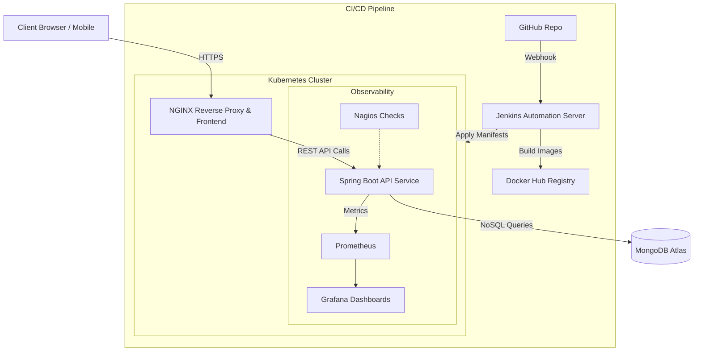

# TravelSphere – Cloud-Native Tourism & Smart Itinerary Management Platform

TravelSphere is an intelligent, scalable travel recommendation engine architected on a microservices-inspired paradigm. By leveraging a stateless algorithmic scoring system, it instantly matches users with global destinations tailored to their budget, climate preferences, and travel styles.

<div align="center">
  
  
  
  
  
  
  
  
</div>

<br />

## 🏛️ System Architecture



## 🚀 Key Engineering Features

- **Stateless Algorithmic Recommendation Engine**: A high-performance scoring algorithm embedded in the Java backend dynamically evaluates and ranks destinations against user-defined weights (budget limits, travel style vectors, and climate profiles) with sub-second latency.
- **JWT Role-Based Access Control (RBAC)**: Secure, stateless authentication utilizing signed JSON Web Tokens. Administrative routes and sensitive user endpoints are strictly gated via Spring Security context authorization.
- **Observability Pipeline & Metrics**: Complete application telemetry via Spring Boot Actuator, visualized through a Prometheus-to-Grafana pipeline, complemented by Nagios active polling for guaranteed API uptime and performance SLA monitoring.
- **Containerized DevOps Lifecycle**: Fully isolated execution environments via multi-stage Dockerfiles, automatically built and deployed to a local Kubernetes cluster utilizing automated Jenkins pipelines.

## 🛠️ Quick Start

To spin up the entire application stack locally using Docker Compose:

```bash
# Clone the repository
git clone https://github.com/aadikp/TravelSphere.git
cd TravelSphere

# Spin up the infrastructure
docker compose up -d --build
```

The frontend application will be instantly available at `http://localhost:5173`, successfully proxying requests to the backend Spring Boot container.


